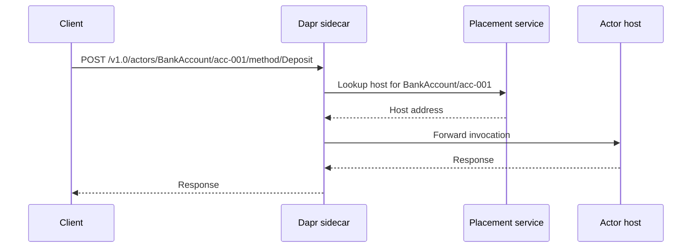

The actor building block implements the [virtual actor pattern](https://www.microsoft.com/en-us/research/project/orleans-virtual-actors/), giving you stateful objects that are location-transparent and single-threaded. Each actor instance is uniquely identified by its **actor type** and **actor ID**. The Dapr placement service automatically manages actor distribution across your cluster.

<CardGroup cols={2}>
  <Card title="Single-threaded execution" icon="arrow-right-to-arc">
    Dapr guarantees that at most one request executes inside an actor at a time, eliminating race conditions without locks.
  </Card>
  <Card title="Location transparency" icon="location-dot">
    Callers invoke actors by type and ID. Dapr routes requests to the correct host automatically.
  </Card>
  <Card title="Built-in state" icon="database">
    Each actor has its own isolated key-value state store. State is saved and loaded transparently.
  </Card>
  <Card title="Reminders and timers" icon="clock">
    Schedule work inside actors with persistent reminders or lightweight timers.
  </Card>
</CardGroup>

## How it works



When an actor is first invoked, Dapr activates it on one of the registered host processes. Subsequent calls to the same actor ID go to the same host, so the actor can safely hold in-memory state between calls.

## Actor types and IDs

An **actor type** maps to an application that has registered it via the actors configuration. An **actor ID** is any string that uniquely identifies an instance within that type.

```
actorType  = "BankAccount"   // registered by your service
actorId    = "acc-001"       // any unique string
```

<Note>
  Actor IDs are opaque strings. Use a domain identifier such as a user ID, order ID, or UUID.
</Note>

## HTTP API

All actor endpoints are under `/v1.0/actors/{actorType}/{actorId}`. Requests are made from your application to its local Dapr sidecar (`http://localhost:3500` by default).

### Invoke an actor method

```bash
POST /v1.0/actors/{actorType}/{actorId}/method/{method}
```

Send a request body (any content type) and receive the actor method's response.

```bash
curl -X POST http://localhost:3500/v1.0/actors/BankAccount/acc-001/method/Deposit \
  -H "Content-Type: application/json" \
  -d '{"amount": 100.00}'
```

<ParamField path="actorType" type="string" required>
  The registered actor type name.
</ParamField>

<ParamField path="actorId" type="string" required>
  The unique identifier of the actor instance.
</ParamField>

<ParamField path="method" type="string" required>
  The method name to invoke on the actor.
</ParamField>

### Manage actor state

Actor state is scoped to the actor instance and is automatically persisted.

```bash
# Get a single state key
GET /v1.0/actors/{actorType}/{actorId}/state/{key}

# Upsert or delete state in a single transaction
POST /v1.0/actors/{actorType}/{actorId}/state
```

The transactional state endpoint accepts an array of operations:

```json
[
  {
    "operation": "upsert",
    "request": {
      "key": "balance",
      "value": 1250.00
    }
  },
  {
    "operation": "delete",
    "request": {
      "key": "pendingTransfer"
    }
  }
]
```

### Reminders

Reminders are **durable**. They survive actor deactivation and service restarts.

```bash
# Create or update a reminder
POST /v1.0/actors/{actorType}/{actorId}/reminders/{name}

# Get a reminder
GET /v1.0/actors/{actorType}/{actorId}/reminders/{name}

# Delete a reminder
DELETE /v1.0/actors/{actorType}/{actorId}/reminders/{name}
```

Reminder request body:

```json
{
  "dueTime": "0h0m30s0ms",
  "period": "0h1m0s0ms",
  "data": "eyJhbW91bnQiOiAxMDB9"
}
```

<ParamField body="dueTime" type="string">
  How long to wait before firing the first reminder. Uses Go duration format (`0h0m30s0ms`).
</ParamField>

<ParamField body="period" type="string">
  How often to repeat after the first firing. Omit for a one-shot reminder.
</ParamField>

<ParamField body="data" type="string">
  Base64-encoded data passed to the actor's reminder callback.
</ParamField>

### Timers

Timers are **ephemeral**. They are cleared when the actor is deactivated.

```bash
# Create or update a timer
POST /v1.0/actors/{actorType}/{actorId}/timers/{name}

# Delete a timer
DELETE /v1.0/actors/{actorType}/{actorId}/timers/{name}
```

Timer request body matches the reminder format. Use timers for transient scheduling that does not need to survive restarts.

## Reminders vs. timers

| | Reminder | Timer |
|---|---|---|
| Persisted | Yes | No |
| Survives restarts | Yes | No |
| Survives deactivation | Yes | No |
| Use when | You need guaranteed execution | You need lightweight in-process scheduling |

<Tip>
  Prefer reminders whenever you need the work to complete even if the service restarts mid-operation.
</Tip>

## Actor re-entrancy

By default, Dapr actors are non-reentrant: a second call to the same actor while a method is executing will queue behind the first. Re-entrancy allows an actor to call itself (or be called in a chain that loops back to it) without deadlocking.

Enable re-entrancy in your actor host configuration:

```yaml
apiVersion: dapr.io/v1alpha1
kind: Configuration
metadata:
  name: appconfig
spec:
  features:
    - name: ActorReentrancy
      enabled: true
```

<Warning>
  Re-entrant actors relax the single-threaded guarantee for re-entrant call chains. Make sure your actor logic handles this correctly.
</Warning>

## Placement service and partitioning

The Dapr placement service maintains a consistent hash ring of all actor hosts. When an actor is invoked:

1. The sidecar queries the placement service for the current host of that actor ID.
2. The placement service returns the address of the responsible host.
3. The sidecar forwards the request.

This means actor state partitions automatically as you scale out. Adding more replicas increases throughput; the placement service redistributes ownership without any application code changes.

## Example: banking account actor

The following example shows a complete actor interaction for a bank account.

<Steps>
  <Step title="Configure the actor host">
    Register your actor type in the Dapr application configuration or via the actors API during app startup. Your service responds to `GET /dapr/config` with:

    ```json
    {
      "entities": ["BankAccount"],
      "actorIdleTimeout": "1h",
      "actorScanInterval": "30s",
      "drainOngoingCallTimeout": "30s",
      "drainRebalancedActors": true
    }
    ```
  </Step>

  <Step title="Invoke a deposit">
    Call the actor's `Deposit` method from any service in the cluster:

    ```bash
    curl -X POST http://localhost:3500/v1.0/actors/BankAccount/acc-001/method/Deposit \
      -H "Content-Type: application/json" \
      -d '{"amount": 500.00}'
    ```
  </Step>

  <Step title="Read the balance">
    Retrieve the `balance` state key directly:

    ```bash
    curl http://localhost:3500/v1.0/actors/BankAccount/acc-001/state/balance
    ```

    ```json
    1500.00
    ```
  </Step>

  <Step title="Schedule a monthly statement reminder">
    Create a recurring reminder that fires on the first of each month:

    ```bash
    curl -X POST http://localhost:3500/v1.0/actors/BankAccount/acc-001/reminders/monthly-statement \
      -H "Content-Type: application/json" \
      -d '{
        "dueTime": "0h0m10s0ms",
        "period": "720h0m0s0ms"
      }'
    ```

    Dapr calls `POST /reminders/monthly-statement` on your actor host when the reminder fires.
  </Step>
</Steps>

## Related

- [Actor API reference](/api/http/actors)
- [State management](/building-blocks/state-management)
- [Workflows](/building-blocks/workflows)
