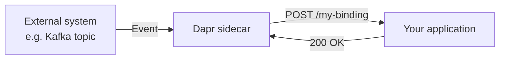

Bindings connect your application to external systems without requiring you to import SDKs or manage connection details. There are two directions:

<CardGroup cols={2}>
  <Card title="Input bindings" icon="arrow-right-to-bracket">
    An external event (message, timer tick, webhook) triggers your app. Dapr calls a route on your service when the event arrives.
  </Card>
  <Card title="Output bindings" icon="arrow-right-from-bracket">
    Your app sends data to an external system. Call the Dapr sidecar API and Dapr handles the delivery.
  </Card>
</CardGroup>

## Input bindings

When an input binding is configured, Dapr subscribes to the external source on your behalf. When an event arrives, Dapr calls:

```
POST /{binding-name}
```

on your application at the port defined in `DAPR_HTTP_PORT` (default `3000`). Your app receives the event payload in the request body and returns a `2xx` status to acknowledge it.



### Handling an input event

Your application needs to expose a route whose name matches the binding component name:

<CodeGroup>

```python python
from flask import Flask, request

app = Flask(__name__)

@app.route('/order-processor', methods=['POST'])
def process_order():
    event = request.get_json()
    print(f"Received order: {event}")
    return '', 200
```

```javascript node.js
const express = require('express');
const app = express();
app.use(express.json());

app.post('/order-processor', (req, res) => {
  console.log('Received order:', req.body);
  res.sendStatus(200);
});
```

```go go
package main

import (
    "encoding/json"
    "fmt"
    "net/http"
)

func orderProcessor(w http.ResponseWriter, r *http.Request) {
    var event map[string]interface{}
    json.NewDecoder(r.Body).Decode(&event)
    fmt.Println("Received order:", event)
    w.WriteHeader(http.StatusOK)
}
```

</CodeGroup>

<Tip>
  Return `404` from the binding route to tell Dapr that this app does not handle the binding. Dapr will not retry.
</Tip>

## Output bindings

Your application calls the Dapr sidecar to send data to an external system:

```bash
POST /v1.0/bindings/{name}
```

### Request body

```json
{
  "data": "<payload to send>",
  "metadata": {
    "key": "value"
  },
  "operation": "create"
}
```

<ParamField body="data" type="any" required>
  The payload to send to the external system. Can be a string, number, object, or binary (base64-encoded).
</ParamField>

<ParamField body="metadata" type="object">
  Component-specific metadata. For example, Kafka bindings accept `partitionKey`; SMTP bindings accept `emailTo`.
</ParamField>

<ParamField body="operation" type="string" required>
  The operation to perform. Common values: `create`, `get`, `delete`, `list`. Supported operations vary by component.
</ParamField>

### Example: send an HTTP request via output binding

```bash
curl -X POST http://localhost:3500/v1.0/bindings/external-api \
  -H "Content-Type: application/json" \
  -d '{
    "data": {
      "orderId": "order-123",
      "amount": 99.99
    },
    "metadata": {},
    "operation": "create"
  }'
```

## Supported components

<CardGroup cols={2}>
  <Card title="Kafka" icon="layer-group">
    Produce and consume messages from Apache Kafka topics.
  </Card>
  <Card title="Azure Event Hubs" icon="microsoft">
    Stream millions of events per second from Azure Event Hubs.
  </Card>
  <Card title="AWS SQS" icon="aws">
    Reliable message queuing with Amazon Simple Queue Service.
  </Card>
  <Card title="Cron" icon="clock">
    Trigger your app on a schedule using cron expressions.
  </Card>
  <Card title="HTTP" icon="globe">
    Call any HTTP endpoint as an output binding.
  </Card>
  <Card title="SMTP" icon="envelope">
    Send email via any SMTP server.
  </Card>
  <Card title="RabbitMQ" icon="circle-nodes">
    Produce and consume messages from RabbitMQ queues.
  </Card>
  <Card title="Azure Service Bus" icon="microsoft">
    Enterprise messaging with Azure Service Bus queues and topics.
  </Card>
</CardGroup>

## Component configuration

Define a binding with a Dapr component YAML file. The `type` field determines which external system Dapr connects to.

### Input binding: cron trigger

```yaml
apiVersion: dapr.io/v1alpha1
kind: Component
metadata:
  name: scheduler
  namespace: default
spec:
  type: bindings.cron
  version: v1
  metadata:
    - name: schedule
      value: "@every 1m"
```

With this component in place, Dapr calls `POST /scheduler` on your app every minute.

### Output binding: HTTP

```yaml
apiVersion: dapr.io/v1alpha1
kind: Component
metadata:
  name: external-api
  namespace: default
spec:
  type: bindings.http
  version: v1
  metadata:
    - name: url
      value: "https://api.example.com/orders"
```

### Input + output binding: Kafka

Many binding components support both directions from a single component definition:

```yaml
apiVersion: dapr.io/v1alpha1
kind: Component
metadata:
  name: order-processor
  namespace: default
spec:
  type: bindings.kafka
  version: v1
  metadata:
    - name: brokers
      value: "kafka-broker:9092"
    - name: topics
      value: "orders"
    - name: consumerGroup
      value: "order-service"
    - name: publishTopic
      value: "processed-orders"
    - name: authRequired
      value: "false"
```

## End-to-end example: cron trigger and HTTP output

This example shows a service that wakes up every minute, calls an external REST API, and logs the result.

<Steps>
  <Step title="Define the cron input binding">
    ```yaml
    apiVersion: dapr.io/v1alpha1
    kind: Component
    metadata:
      name: every-minute
    spec:
      type: bindings.cron
      version: v1
      metadata:
        - name: schedule
          value: "@every 1m"
    ```
  </Step>

  <Step title="Define the HTTP output binding">
    ```yaml
    apiVersion: dapr.io/v1alpha1
    kind: Component
    metadata:
      name: stats-api
    spec:
      type: bindings.http
      version: v1
      metadata:
        - name: url
          value: "https://api.example.com/stats"
    ```
  </Step>

  <Step title="Handle the trigger and call the API">
    ```python
    from flask import Flask, request
    import requests

    app = Flask(__name__)
    DAPR_URL = "http://localhost:3500"

    @app.route('/every-minute', methods=['POST'])
    def on_tick():
        # Call the external API via Dapr output binding
        response = requests.post(
            f"{DAPR_URL}/v1.0/bindings/stats-api",
            json={
                "data": {"source": "my-service"},
                "metadata": {},
                "operation": "create"
            }
        )
        print(f"Stats API responded: {response.status_code}")
        return '', 200
    ```
  </Step>
</Steps>

## Related

- [Pub/Sub messaging](/building-blocks/pub-sub)
- [Bindings API reference](/api/http/bindings)
