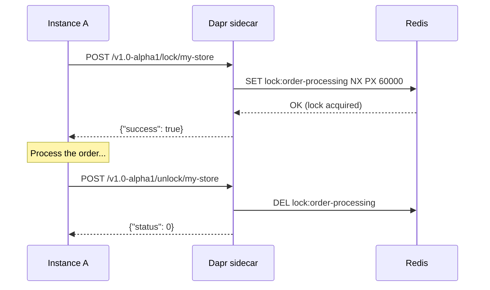

The distributed lock building block provides a way to acquire exclusive access to a shared resource across multiple application instances. This prevents race conditions when multiple replicas of your service attempt to operate on the same data simultaneously.

<Warning>
  The distributed lock API is currently in **alpha** (`v1.0-alpha1`). The API surface may change in future releases.
</Warning>

<CardGroup cols={2}>
  <Card title="Mutual exclusion" icon="lock">
    Only one lock holder can access the resource at a time across all instances and hosts.
  </Card>
  <Card title="Automatic expiry" icon="clock">
    Locks expire after a configurable number of seconds, preventing deadlocks if a holder crashes.
  </Card>
  <Card title="Unique ownership" icon="fingerprint">
    Each lock is tied to a `lockOwner` ID. Only the owner can release it.
  </Card>
  <Card title="Redis-backed" icon="database">
    Lock state is stored in Redis for fast, reliable distributed coordination.
  </Card>
</CardGroup>

## How it works



If a second instance tries to acquire the same lock while Instance A holds it, the sidecar returns `{"success": false}` immediately (try-lock semantics — it does not block).

## HTTP API

### Acquire a lock

```bash
POST /v1.0-alpha1/lock/{storeName}
```

```bash
curl -X POST http://localhost:3500/v1.0-alpha1/lock/my-lock-store \
  -H "Content-Type: application/json" \
  -d '{
    "resourceId": "order-processing",
    "lockOwner": "instance-a-7d9f4",
    "expiryInSeconds": 60
  }'
```

Response when the lock is acquired:

```json
{
  "success": true
}
```

Response when the lock is already held:

```json
{
  "success": false
}
```

<ParamField path="storeName" type="string" required>
  The name of the lock store component.
</ParamField>

<ParamField body="resourceId" type="string" required>
  A string identifying the resource to lock. All instances that want mutual exclusion must use the same value.
</ParamField>

<ParamField body="lockOwner" type="string" required>
  A unique identifier for the lock holder. Use a value that is unique per application instance, such as a UUID generated at startup or the pod name. Only this owner can release the lock.
</ParamField>

<ParamField body="expiryInSeconds" type="number" required>
  How many seconds before the lock automatically expires. Set this to slightly longer than the expected operation duration. Minimum: `1`.
</ParamField>

### Release a lock

```bash
POST /v1.0-alpha1/unlock/{storeName}
```

```bash
curl -X POST http://localhost:3500/v1.0-alpha1/unlock/my-lock-store \
  -H "Content-Type: application/json" \
  -d '{
    "resourceId": "order-processing",
    "lockOwner": "instance-a-7d9f4"
  }'
```

Response:

```json
{
  "status": 0
}
```

The `status` field is an integer code:

| Code | Meaning |
|------|---------|
| `0` | Lock released successfully |
| `1` | Lock does not exist (already expired or never acquired) |
| `2` | Lock is owned by a different owner |
| `3` | Internal error |

<ParamField body="resourceId" type="string" required>
  The same resource ID used when acquiring the lock.
</ParamField>

<ParamField body="lockOwner" type="string" required>
  Must match the `lockOwner` used when the lock was acquired. The unlock fails if it does not match.
</ParamField>

## Component configuration

### Redis

```yaml
apiVersion: dapr.io/v1alpha1
kind: Component
metadata:
  name: my-lock-store
  namespace: default
spec:
  type: lock.redis
  version: v1
  metadata:
    - name: redisHost
      value: "redis.example.com:6379"
    - name: redisPassword
      secretKeyRef:
        name: redis-password
        key: password
    - name: enableTLS
      value: "true"
```

<Tip>
  Use a dedicated Redis instance or at least a dedicated keyspace for locks. Mixing lock keys with application cache data can lead to unexpected key evictions.
</Tip>

## Example: preventing duplicate order processing

Multiple instances of an order service may receive the same order event due to at-least-once delivery. A distributed lock ensures exactly one instance processes each order.

<Steps>
  <Step title="Configure the lock store">
    ```yaml
    apiVersion: dapr.io/v1alpha1
    kind: Component
    metadata:
      name: order-locks
    spec:
      type: lock.redis
      version: v1
      metadata:
        - name: redisHost
          value: "redis:6379"
    ```
  </Step>

  <Step title="Generate a unique instance owner ID at startup">
    ```python
    import uuid

    # Generate once per process, not per request
    LOCK_OWNER = f"order-service-{uuid.uuid4()}"
    DAPR_URL = "http://localhost:3500"
    ```
  </Step>

  <Step title="Try to acquire the lock before processing">
    ```python
    import requests

    def try_process_order(order_id: str) -> bool:
        # Try to acquire the lock
        lock_resp = requests.post(
            f"{DAPR_URL}/v1.0-alpha1/lock/order-locks",
            json={
                "resourceId": f"order-{order_id}",
                "lockOwner": LOCK_OWNER,
                "expiryInSeconds": 30
            }
        )
        lock_resp.raise_for_status()

        if not lock_resp.json().get("success"):
            print(f"Order {order_id} is already being processed by another instance")
            return False

        try:
            process_order(order_id)
            return True
        finally:
            # Always release the lock
            requests.post(
                f"{DAPR_URL}/v1.0-alpha1/unlock/order-locks",
                json={
                    "resourceId": f"order-{order_id}",
                    "lockOwner": LOCK_OWNER
                }
            )
    ```
  </Step>
</Steps>

<Warning>
  Always release locks in a `finally` block (or equivalent). If your application exits while holding a lock, the lock expires automatically after `expiryInSeconds` — but releasing it explicitly is faster and more reliable.
</Warning>

## Lock owner ID best practices

- Generate the owner ID once per process or pod, not per request. Using a request-scoped ID means you cannot release a lock created in an earlier request.
- Include a recognizable prefix (e.g., `order-service-`) to make debugging easier.
- In Kubernetes, `POD_NAME` is a reliable unique-per-instance value.

```python
import os
import uuid

# Option 1: use Kubernetes pod name
LOCK_OWNER = os.environ.get("POD_NAME", str(uuid.uuid4()))
```

## Related

- [State management](/building-blocks/state-management)
- [Distributed lock API reference](/api/http/distributed-lock)
