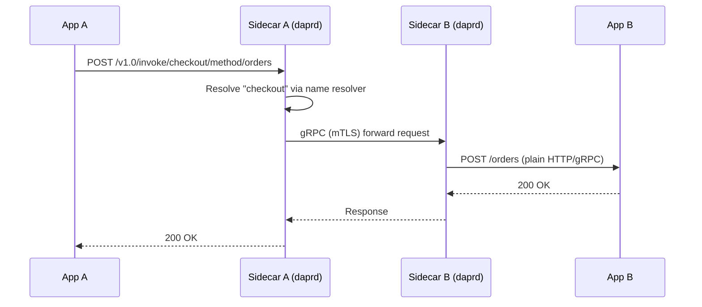

Service invocation lets your application call methods on other Dapr-enabled services using a simple HTTP or gRPC API. Dapr resolves the target service, establishes a secure channel, and handles retries — your application only needs to know the target's app ID.

<CardGroup cols={2}>
  <Card title="Service discovery" icon="magnifying-glass">
    Dapr resolves app IDs to network addresses using pluggable name resolvers (mDNS, Kubernetes DNS, Consul).
  </Card>
  <Card title="Mutual TLS" icon="lock">
    All sidecar-to-sidecar traffic is encrypted and mutually authenticated with auto-rotated certificates.
  </Card>
  <Card title="Retries and timeouts" icon="rotate">
    Dapr applies configurable resiliency policies — retries, circuit breakers, and timeouts — between services.
  </Card>
  <Card title="Distributed tracing" icon="chart-network">
    W3C TraceContext headers are propagated automatically, giving end-to-end traces across service calls.
  </Card>
</CardGroup>

## How it works

Your application calls its **local** Dapr sidecar. The sidecar discovers the target service's sidecar, opens a secure channel, and forwards the request.



<Steps>
  <Step title="App A sends a request to its sidecar">
    The calling application posts to `http://localhost:3500/v1.0/invoke/{appId}/method/{methodName}`. No service registry or SDK is required.
  </Step>
  <Step title="Sidecar A resolves the target">
    The local sidecar queries the configured name resolver to find the network address of the target app's sidecar.
  </Step>
  <Step title="Sidecar-to-sidecar communication">
    Dapr forwards the request over gRPC with mTLS. The target sidecar proxies the call to App B using the app's preferred protocol (HTTP or gRPC).
  </Step>
  <Step title="Response is returned">
    The response travels back through both sidecars and is returned to App A with the original HTTP status code and body.
  </Step>
</Steps>

## API

### Invoke a method

```
POST/GET/PUT/DELETE http://localhost:3500/v1.0/invoke/{appId}/method/{method-name}
```

The HTTP verb, headers, query string, and body of your request are forwarded to the target service unchanged.

<ParamField path="appId" type="string" required>
  The Dapr app ID of the target service, as set with the `--app-id` flag when the target sidecar was started.
</ParamField>

<ParamField path="method-name" type="string" required>
  The method path on the target application. Nested paths are supported (e.g., `orders/items/42`).
</ParamField>

### Example: calling the checkout service

```bash
curl -X POST http://localhost:3500/v1.0/invoke/checkout/method/orders \
  -H "Content-Type: application/json" \
  -d '{"orderId": "100", "item": "widget", "quantity": 2}'
```

The `checkout` service receives a plain `POST /orders` request on its own port.

## Name resolution

The resolver used depends on your hosting environment.

<Tabs>
  <Tab title="Self-hosted (mDNS)">
    Dapr uses mDNS multicast to discover sidecars on the local network. No additional configuration is required for single-host or LAN environments.

    ```yaml
    # No extra component needed — mDNS is the default resolver
    ```
  </Tab>
  <Tab title="Kubernetes">
    The Kubernetes name resolver uses the Kubernetes DNS service (`{appId}.{namespace}.svc.cluster.local`). It is selected automatically when Dapr is deployed on Kubernetes.
  </Tab>
  <Tab title="Consul">
    Register a `nameresolution.consul` component to use HashiCorp Consul for service discovery in multi-cluster or hybrid environments.

    ```yaml
    apiVersion: dapr.io/v1alpha1
    kind: Component
    metadata:
      name: nameresolution
    spec:
      type: nameresolution.consul
      version: v1
      metadata:
        - name: selfRegister
          value: "true"
    ```
  </Tab>
</Tabs>

## Supported protocols

<Tabs>
  <Tab title="HTTP">
    By default, Dapr forwards calls to the target app over HTTP on the port specified by `--app-port`. All standard HTTP methods (GET, POST, PUT, PATCH, DELETE) are supported.

    ```bash
    # Calling order-processor's /pay endpoint from another service
    curl http://localhost:3500/v1.0/invoke/order-processor/method/pay \
      -X POST \
      -H "Content-Type: application/json" \
      -d '{"amount": 49.99}'
    ```
  </Tab>
  <Tab title="gRPC">
    Set `--app-protocol grpc` on the target sidecar and Dapr will proxy requests as gRPC calls. The calling side still uses the Dapr HTTP or gRPC API — the target-side protocol is an implementation detail.

    ```bash
    daprd --app-id order-processor \
          --app-port 50051 \
          --app-protocol grpc
    ```
  </Tab>
</Tabs>

## Header forwarding

Dapr forwards all HTTP headers from the caller to the target service, and all response headers back to the caller. Several headers are injected or enriched by the Dapr sidecar:

| Header | Direction | Description |
|--------|-----------|-------------|
| `traceparent` | Both | W3C TraceContext trace ID for distributed tracing. |
| `tracestate` | Both | W3C TraceContext vendor-specific trace state. |
| `baggage` | Both | OpenTelemetry baggage propagation. |
| `dapr-app-id` | Inbound | App ID of the caller, set by the calling sidecar. |

<Note>
  The `dapr-app-id` header on inbound requests is set by the calling sidecar, not by the caller application. You can use it for basic caller identification, but do not rely on it for authorization without mTLS enforcement.
</Note>

## Error handling and retries

When a service invocation call fails, Dapr returns the HTTP status code from the target service directly to the caller. Network-level failures use `503 Service Unavailable`.

Configure retry and circuit-breaker policies with a **Resiliency** spec:

```yaml
apiVersion: dapr.io/v1alpha1
kind: Resiliency
metadata:
  name: myresiliency
spec:
  policies:
    retries:
      retryThreeTimes:
        policy: constant
        duration: 5s
        maxRetries: 3
    circuitBreakers:
      simpleCB:
        maxRequests: 1
        timeout: 30s
        trip: consecutiveFailures >= 5
  targets:
    apps:
      checkout:
        retry: retryThreeTimes
        circuitBreaker: simpleCB
```

<Tip>
  Resiliency policies are scoped to a specific target app ID, so retry budgets for one service do not affect calls to other services.
</Tip>

## Complete example: order-processor calling checkout

The `order-processor` service places an order by invoking the `checkout` service:

<CodeGroup>

```python order_processor.py
import requests

dapr_port = 3500
order = {"orderId": "42", "item": "widget", "quantity": 3}

response = requests.post(
    f"http://localhost:{dapr_port}/v1.0/invoke/checkout/method/orders",
    json=order,
)
response.raise_for_status()
print(f"Order placed: {response.json()}")
```

```go order_processor.go
package main

import (
    "bytes"
    "encoding/json"
    "fmt"
    "net/http"
)

func main() {
    order := map[string]any{
        "orderId":  "42",
        "item":     "widget",
        "quantity": 3,
    }
    body, _ := json.Marshal(order)

    resp, err := http.Post(
        "http://localhost:3500/v1.0/invoke/checkout/method/orders",
        "application/json",
        bytes.NewReader(body),
    )
    if err != nil {
        panic(err)
    }
    defer resp.Body.Close()
    fmt.Println("Status:", resp.Status)
}
```

```javascript order_processor.js
import fetch from 'node-fetch';

const order = { orderId: '42', item: 'widget', quantity: 3 };

const res = await fetch(
  'http://localhost:3500/v1.0/invoke/checkout/method/orders',
  {
    method: 'POST',
    headers: { 'Content-Type': 'application/json' },
    body: JSON.stringify(order),
  }
);

console.log('Status:', res.status);
```

</CodeGroup>

The `checkout` service receives the call as a normal `POST /orders` request on its own HTTP port and does not need to know about Dapr at all.
