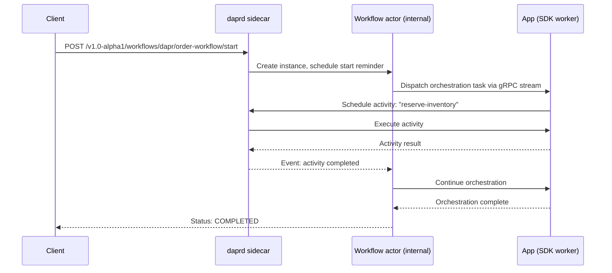

The Dapr workflow building block lets you write long-running, stateful process orchestrations in code. Workflow state, timers, and activity scheduling are persisted automatically — a workflow survives application restarts, VM migrations, and transient failures without any special handling in your code.

<CardGroup cols={2}>
  <Card title="Durable execution" icon="hard-drive">
    Workflows are backed by the Durable Task Framework and persist their state in the configured actor state store. Execution resumes automatically after failures.
  </Card>
  <Card title="Built on actors" icon="cubes">
    Each workflow instance maps to a `dapr.internal.wfengine.workflow` actor. Turn-based concurrency and reminder-driven execution are handled by the Dapr runtime.
  </Card>
  <Card title="Language SDKs" icon="code">
    Write workflow logic in Python, .NET, Java, or Go using the Dapr SDK. The orchestration and activity functions run in your application process.
  </Card>
  <Card title="Full lifecycle control" icon="sliders">
    Start, pause, resume, terminate, and purge workflow instances via the HTTP API or SDK without redeploying the application.
  </Card>
</CardGroup>

## How the workflow engine works

Each workflow instance corresponds to an internal actor (`dapr.internal.wfengine.workflow`) whose ID matches the instance ID. The actor persists an event history and an inbox in the configured state store using per-event keys (`history-000000`, `inbox-000000`, etc.). A reminder-per-step drives execution forward; if a step fails, the reminder fires again after a cooldown period to retry automatically.

Your workflow code runs in your application process. The Dapr SDK opens a gRPC work-item stream to the sidecar, receives orchestration tasks, executes activities, and returns results — without the application needing to know about actors or reminders.



## HTTP API reference

The workflow API is available at all stable (`v1.0`), beta (`v1.0-beta1`), and alpha (`v1.0-alpha1`) versions. The `v1.0-alpha1` paths shown below are the original endpoints; the stable `v1.0` equivalents use identical paths with a different version prefix.

### Start a workflow

```
POST /v1.0-alpha1/workflows/{workflowComponent}/{workflowName}/start
```

<ParamField path="workflowComponent" type="string" required>
  The workflow component to use. The built-in component name is `dapr`.
</ParamField>

<ParamField path="workflowName" type="string" required>
  The name of the workflow function registered with the Dapr SDK in your application.
</ParamField>

<ParamField query="instanceID" type="string">
  A user-supplied instance ID. Must be 64 characters or fewer and contain only letters, digits, `-`, and `_`. If omitted, Dapr generates a random UUID. Returned in the response body.
</ParamField>

The request body is passed verbatim as the workflow's input. No Content-Type assumption is made.

```bash
curl -X POST \
  "http://localhost:3500/v1.0-alpha1/workflows/dapr/order-workflow/start?instanceID=order-d6e5f6a0" \
  -H "Content-Type: application/json" \
  -d '{"orderId": "d6e5f6a0", "item": "widget", "quantity": 3}'
```

Returns `202 Accepted`:

```json
{
  "instanceID": "order-d6e5f6a0"
}
```

### Get workflow status

```
GET /v1.0-alpha1/workflows/{workflowComponent}/{instanceID}
```

```bash
curl http://localhost:3500/v1.0-alpha1/workflows/dapr/order-d6e5f6a0
```

Response:

```json
{
  "instanceID": "order-d6e5f6a0",
  "workflowName": "order-workflow",
  "createdAt": "2024-03-15T10:30:00Z",
  "lastUpdatedAt": "2024-03-15T10:30:05Z",
  "runtimeStatus": "COMPLETED",
  "properties": {
    "dapr.workflow.input": "{\"orderId\": \"d6e5f6a0\", \"item\": \"widget\", \"quantity\": 3}",
    "dapr.workflow.output": "{\"status\": \"fulfilled\"}",
    "dapr.workflow.custom_status": ""
  }
}
```

<ParamField body="runtimeStatus" type="string">
  One of `RUNNING`, `COMPLETED`, `FAILED`, `CANCELED`, `TERMINATED`, `PENDING`, or `SUSPENDED`.
</ParamField>

<ParamField body="properties" type="object">
  Map of workflow metadata. Includes `dapr.workflow.input`, `dapr.workflow.output`, and `dapr.workflow.custom_status` when set by the workflow.
</ParamField>

### Terminate a workflow

```
POST /v1.0-alpha1/workflows/{workflowComponent}/{instanceID}/terminate
```

Terminates a running instance immediately. In-progress activities are allowed to finish but no new ones are scheduled. Returns `202 Accepted`.

```bash
curl -X POST http://localhost:3500/v1.0-alpha1/workflows/dapr/order-d6e5f6a0/terminate
```

<Warning>
  Termination is non-reversible. Sub-workflows started by the terminated instance are also terminated recursively.
</Warning>

### Pause a workflow

```
POST /v1.0-alpha1/workflows/{workflowComponent}/{instanceID}/pause
```

Suspends scheduling of new work items. In-progress activities continue. Returns `202 Accepted`.

```bash
curl -X POST http://localhost:3500/v1.0-alpha1/workflows/dapr/order-d6e5f6a0/pause
```

### Resume a workflow

```
POST /v1.0-alpha1/workflows/{workflowComponent}/{instanceID}/resume
```

Resumes a previously paused workflow. Returns `202 Accepted`.

```bash
curl -X POST http://localhost:3500/v1.0-alpha1/workflows/dapr/order-d6e5f6a0/resume
```

### Raise an external event

```
POST /v1.0-alpha1/workflows/{workflowComponent}/{instanceID}/raiseEvent/{eventName}
```

<ParamField path="eventName" type="string" required>
  The event name your workflow is waiting on (as passed to `wait_for_external_event` in the SDK).
</ParamField>

The request body is the event payload and is passed verbatim to the workflow.

```bash
curl -X POST \
  http://localhost:3500/v1.0-alpha1/workflows/dapr/order-d6e5f6a0/raiseEvent/approval-received \
  -H "Content-Type: application/json" \
  -d '{"approvedBy": "manager@example.com", "approvedAt": "2024-03-15T11:00:00Z"}'
```

Returns `202 Accepted`.

### Purge a workflow

```
POST /v1.0-alpha1/workflows/{workflowComponent}/{instanceID}/purge
```

Deletes all workflow state from the state store. Only valid for instances in a terminal state (`COMPLETED`, `FAILED`, `TERMINATED`). Returns `202 Accepted`.

```bash
curl -X POST http://localhost:3500/v1.0-alpha1/workflows/dapr/order-d6e5f6a0/purge
```

<Note>
  Completed workflow state is not purged automatically. Call the purge endpoint when state is no longer needed to prevent unbounded state store growth.
</Note>

## Workflow patterns

### Sequential activities

Execute a chain of activities one after the other:

```python
import dapr.ext.workflow as wf

def order_workflow(ctx: wf.DaprWorkflowContext, order: dict):
    # Each call_activity suspends the orchestration until the activity completes
    inventory = yield ctx.call_activity(check_inventory, input=order)
    payment = yield ctx.call_activity(process_payment, input={"order": order, "inventory": inventory})
    yield ctx.call_activity(ship_order, input={"order": order, "payment": payment})
    return {"status": "fulfilled"}
```

### Parallel fan-out / fan-in

Start multiple activities concurrently and wait for all of them:

```python
def fan_out_workflow(ctx: wf.DaprWorkflowContext, items: list):
    # Launch all activities in parallel
    tasks = [ctx.call_activity(process_item, input=item) for item in items]
    # Wait for all tasks to finish (fan-in)
    results = yield wf.when_all(tasks)
    return {"processed": len(results)}
```

### External event handling

Pause the workflow until an external signal arrives:

```python
def approval_workflow(ctx: wf.DaprWorkflowContext, request: dict):
    yield ctx.call_activity(notify_approver, input=request)

    # Wait up to 24 hours for an approval event
    approval = yield ctx.wait_for_external_event("approval-received",
                                                  timeout=timedelta(hours=24))
    if approval is None:
        yield ctx.call_activity(expire_request, input=request)
        return {"status": "expired"}

    yield ctx.call_activity(fulfill_request, input={"request": request, "approval": approval})
    return {"status": "approved"}
```

Raise the event from any service:

```bash
curl -X POST \
  http://localhost:3500/v1.0-alpha1/workflows/dapr/approval-abc123/raiseEvent/approval-received \
  -H "Content-Type: application/json" \
  -d '{"approvedBy": "alice@example.com"}'
```

### Sub-workflows

Compose large workflows from smaller, reusable workflow functions:

```python
def parent_workflow(ctx: wf.DaprWorkflowContext, batch: list):
    # Each item is processed by a dedicated child workflow
    tasks = [ctx.call_child_workflow(process_order_workflow, input=order)
             for order in batch]
    results = yield wf.when_all(tasks)
    return {"batchSize": len(batch), "succeeded": sum(1 for r in results if r["status"] == "fulfilled")}
```

## Workflow activities

Activities are the individual units of work in a workflow. They run in your application process and can call external services, read/write state, publish events, or perform any other I/O. Unlike workflow orchestration functions, activities are allowed to be non-deterministic.

```python
def check_inventory(ctx: wf.ActivityContext, order: dict) -> dict:
    # Regular application code — call databases, APIs, etc.
    available = inventory_service.check(order["item"], order["quantity"])
    return {"available": available, "item": order["item"]}

def process_payment(ctx: wf.ActivityContext, input: dict) -> dict:
    result = payment_gateway.charge(
        amount=input["order"]["price"],
        customer=input["order"]["customerId"],
    )
    return {"transactionId": result.transaction_id}
```

Register activities alongside the workflow when starting the worker:

```python
wf_runtime = wf.WorkflowRuntime()
wf_runtime.register_workflow(order_workflow)
wf_runtime.register_activity(check_inventory)
wf_runtime.register_activity(process_payment)
wf_runtime.register_activity(ship_order)
wf_runtime.start()
```

## Complete example: order processing workflow

<CodeGroup>

```python workflow_app.py
import dapr.ext.workflow as wf
from dapr.clients import DaprClient

def order_workflow(ctx: wf.DaprWorkflowContext, order: dict):
    """Main order processing orchestration."""
    try:
        # Step 1: Reserve inventory
        inventory = yield ctx.call_activity(
            reserve_inventory,
            input={"item": order["item"], "quantity": order["quantity"]},
        )

        # Step 2: Charge the customer
        payment = yield ctx.call_activity(
            charge_customer,
            input={"customerId": order["customerId"], "amount": order["amount"]},
        )

        # Step 3: Dispatch shipment
        yield ctx.call_activity(
            dispatch_shipment,
            input={"orderId": order["orderId"], "item": order["item"]},
        )

        return {"status": "fulfilled", "paymentId": payment["transactionId"]}

    except Exception as e:
        # Compensate: release reserved inventory on failure
        yield ctx.call_activity(release_inventory, input=inventory)
        return {"status": "failed", "reason": str(e)}


def reserve_inventory(ctx: wf.ActivityContext, input: dict) -> dict:
    print(f"Reserving {input['quantity']}x {input['item']}")
    return {"reservationId": "res-001", "item": input["item"]}


def charge_customer(ctx: wf.ActivityContext, input: dict) -> dict:
    print(f"Charging customer {input['customerId']} ${input['amount']}")
    return {"transactionId": "txn-abc123"}


def dispatch_shipment(ctx: wf.ActivityContext, input: dict) -> None:
    print(f"Dispatching shipment for order {input['orderId']}")


def release_inventory(ctx: wf.ActivityContext, reservation: dict) -> None:
    print(f"Releasing reservation {reservation['reservationId']}")


if __name__ == "__main__":
    wf_runtime = wf.WorkflowRuntime()
    wf_runtime.register_workflow(order_workflow)
    wf_runtime.register_activity(reserve_inventory)
    wf_runtime.register_activity(charge_customer)
    wf_runtime.register_activity(dispatch_shipment)
    wf_runtime.register_activity(release_inventory)
    wf_runtime.start()

    # Start a workflow instance via the SDK client
    with DaprClient() as client:
        instance_id = client.start_workflow(
            workflow_component="dapr",
            workflow_name="order_workflow",
            input={
                "orderId": "d6e5f6a0",
                "item": "widget",
                "quantity": 3,
                "amount": 49.99,
                "customerId": "user42",
            },
        ).instance_id
        print(f"Started workflow: {instance_id}")

        # Poll for completion
        result = client.wait_for_workflow_completion(
            instance_id=instance_id,
            workflow_component="dapr",
            timeout_in_seconds=30,
        )
        print(f"Workflow result: {result.runtime_status}")
```

```bash curl
# Start the workflow
curl -X POST \
  "http://localhost:3500/v1.0-alpha1/workflows/dapr/order_workflow/start?instanceID=order-d6e5f6a0" \
  -H "Content-Type: application/json" \
  -d '{
    "orderId": "d6e5f6a0",
    "item": "widget",
    "quantity": 3,
    "amount": 49.99,
    "customerId": "user42"
  }'

# Poll status until COMPLETED
curl http://localhost:3500/v1.0-alpha1/workflows/dapr/order-d6e5f6a0

# Purge state when done
curl -X POST http://localhost:3500/v1.0-alpha1/workflows/dapr/order-d6e5f6a0/purge
```

</CodeGroup>

## Instance ID constraints

Instance IDs are validated when a workflow is started. Invalid IDs return `400 Bad Request`.

| Constraint | Value |
|-----------|-------|
| Maximum length | 64 characters |
| Allowed characters | Letters (`a-z`, `A-Z`), digits (`0-9`), `-`, `_` |
| Spaces or special characters | Not allowed |

<Tip>
  Use a domain-meaningful ID like `order-{orderId}` instead of a bare UUID. Meaningful IDs make it easier to query workflow status from other services without a separate lookup.
</Tip>

## State retention

Workflow state (`history-*`, `inbox-*`, `metadata`, `customStatus`) is stored in the actor state store. By default, state is retained indefinitely after a workflow completes. Configure a retention policy in your Dapr application configuration to auto-purge completed instances:

```yaml
apiVersion: dapr.io/v1alpha1
kind: Configuration
metadata:
  name: appconfig
spec:
  features:
    - name: WorkflowStateRetentionPolicy
      enabled: true
  workflow:
    stateRetentionPolicy:
      ttlInSeconds: 604800  # 7 days
```
